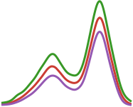

<h1 align="center">
 BayesDensity.jl
</h1>

<div align="center">

[](https://oskarhs.github.io/BayesDensity.jl/stable/)
[](https://oskarhs.github.io/BayesDensity.jl/dev/)
[](https://github.com/oskarhs/BayesDensity.jl/actions/workflows/CI.yml?query=branch%3Amaster)
[](https://github.com/JuliaTesting/Aqua.jl)
</div>


BayesDensity.jl is a Julia package for nonparametric univariate Bayesian density estimation. It provides access to many different density estimators from the statistical literature under a unified API. Supports model fitting through Markov chain Monte Carlo and approximate inference through variational inference algorithms.

## Installation

The BayesDensity.jl package is currently not part of any package repository, but can be installed from its GitHub repository as follows:
```@repl
using Pkg
Pkg.add(url="https://github.com/oskarhs/BayesianDensityEstimation.jl/lib/BayesDensity.jl")
```

Alternatively, it is possible to install each of the Bayesian density estimators implemented in this package separately. For instance, the B-spline mixture model estimator can be downloaded as follows:
```@repl
Pkg.add(url="https://github.com/oskarhs/BayesianDensityEstimation.jl/lib/BayesDensityBSM.jl")
```

## Quick start

To get started, we illustrate the basic use of the package by fitting a B-spline mixture model to a two-component mixture of normal densities:

```julia
using BayesDensity, Distributions, Random
rng = Random.Xoshiro(1) # for reproducibility

# Simulate some data:
d_true = MixtureModel([Normal(-0.2, 0.25), Normal(0.5, 0.15)], [0.4, 0.6])
x = rand(rng, d_true, 1000)

# Create a B-Spline mixture model object:
bsm = BSMModel(x)
```

Having specified a model for the data, we can perform posterior inference through Markov chain Monte Carlo methods or variational inference:

```julia
mcmc_fit = sample(rng, bsm, 5000; n_burnin=1000) # MCMC
vi_fit = varinf(bsm) # VI
```

The resulting fitted model objects can be used to compute posterior quantities of interest such as the posterior median of $f(t)$ through `median(mcmc_fit, t)`. Additionally, the package also provides convenience plotting functions through its [Makie.jl](https://github.com/MakieOrg/Makie.jl) and [Plots.jl](https://github.com/JuliaPlots/Plots.jl) extensions, making it easy to visualize the density estimates. For instance, one can easily plot the posterior mean, along with a 95% credible interval with Makie.jl as follows:

```julia
using CairoMakie
plot(mcmc_fit)
```

For a more thorough introduction to the API and the capabilities of the package, we refer the interested reader to the DOCUMENTATION

TODO list:
- Implement check for proper posterior (BSM)
- Try standardizing the data to see if this improves performance with e.g. the triangle density (BSM)
- Make StatsBase.sample take in initial values as a kwarg.
- Split up general docs into three parts (with an index page to start)
- Finish example on how to implement new models.
- Implement more methods.
- 
- Add (basic) tutorial illustrating the basic use of the package.
- Add a primer on Bayesian nonparametric density estimation.