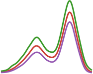

<h1 align="center">
 BayesDensity.jl
</h1>

<div align="center">

[](https://oskarhs.github.io/BayesDensity.jl/stable/)
[](https://oskarhs.github.io/BayesDensity.jl/dev/)
[](https://github.com/oskarhs/BayesDensity.jl/actions/workflows/CI.yml?query=branch%3main)
[](https://codecov.io/gh/oskarhs/BayesDensity.jl)
[](https://doi.org/10.5281/zenodo.18956109)
[](https://github.com/JuliaTesting/Aqua.jl)
</div>


BayesDensity.jl is a Julia package for nonparametric univariate Bayesian density estimation.
It offers a unified interface to a variety of density estimators developed in the statistical literature, and supports posterior inference via both Markov chain Monte Carlo (MCMC) and variational inference methods.
Moreover, the package is designed to be extensible, allowing new estimators to make use of its built-in methods for posterior inference without requiring additional boilerplate code.

## Installation

The BayesDensity.jl package is part of the Julia general registry, and can as such easily be installed via the default package manager:
```julia
using Pkg
Pkg.add("BayesDensity")
```

Alternatively, it is possible to install each of the Bayesian density estimators implemented in this package separately. For instance, the histogram smoother estimator can be downloaded as follows:
```julia
Pkg.add("BayesDensityHistSmoother")
```

## Quick start

To get started, we illustrate the basic use of the package by fitting a histogram smoother to a two-component mixture of normal densities:

```julia
using BayesDensity, Distributions, Random
rng = Random.Xoshiro(1) # for reproducibility

# Simulate some data:
d_true = MixtureModel([Normal(-0.2, 0.25), Normal(0.5, 0.15)], [0.4, 0.6])
x = rand(rng, d_true, 1000)

# Create a histogram smoother model object:
hs = HistSmoother(x)
```

Having specified a model for the data, we can perform posterior inference through Markov chain Monte Carlo methods or variational Bayes:

```julia
mcmc_fit = sample(rng, hs, 5000; n_burnin=1000) # MCMC
vi_fit, info = varinf(hs)                       # VI
```

The resulting fitted model objects can be used to compute posterior quantities of interest such as the posterior median of the density evaluated at given point(s) `t` through `median(mcmc_fit, t)`. Additionally, the package also provides convenience plotting functions through its [Makie.jl](https://github.com/MakieOrg/Makie.jl) and [Plots.jl](https://github.com/JuliaPlots/Plots.jl) extensions, making it easy to visualize the density estimates. For instance, one can easily plot the posterior mean, along with a 95% credible interval with Makie as follows:

```julia
using CairoMakie
plot(mcmc_fit) # Based on MCMC
plot(vi_fit)   # Based on VI
```

For a more thorough introduction to the API and the capabilities of the package, we refer the interested reader to the [documentation](https://oskarhs.github.io/BayesDensity.jl).