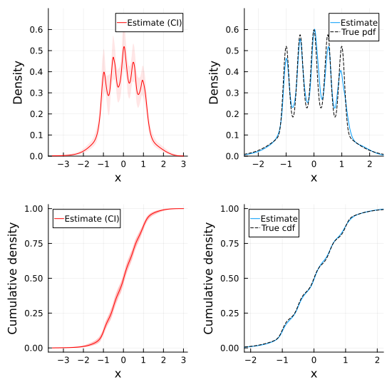

# Plotting API

Graphical displays are a powerful tool for providing informative vizual summaries of the result of a given Bayesian inference procedure for a univariate density. `BayesDensity` makes it easy to plot posterior summaries for ``f`` using the results from Markov chain Monte Carlo sampling or variational inference through its extensions for the [Makie.jl](https://github.com/MakieOrg/Makie.jl) and [Plots.jl](https://github.com/JuliaPlots/Plots.jl) packages.

In addition to documenting the plotting-related public API, this page also showcases the plotting capabilities of the `BayesDensityCore` package through examples. Although we will not delve deep into implementational details here, some familiarity with `Makie.jl` or `Plots.jl` is an advantage when reading this part of the documentation.

The following sections are structured so that the `Makie`- and the `Plots`-portions of the tutorial can be read independently of one another. As such, there is no need for a `Makie` power-user to read the `Plots` sections of this page.

## Plotting with Makie.jl

In general, the available plot method for [`PosteriorSamples`](@ref) and [`AbstractVIPosterior`](@ref) objects has the following signature:
```julia
plot(
    ps::Union{PosteriorSamples, AbstractVIPosterior},
    [func = pdf],
    [t::AbstractVector{<:Real}];
    ci::Bool = true,
    level::Real = 0.95,
    estimate = mean,
    alpha::Real = 0.25,
    kwargs...
)
```
The first argument to `plot` is the posterior distribution, fitted via either Markov chain Monte Carlo or variational inference.
The second (optional) positional argument indicates whether to plot estimates of the `pdf` or the `cdf`. By default, the estimated pdf is shown.
The third (optional) positional argument is the grid at which the `pdf` or `cdf` is evaluated to draw the grid.
The `ci` keyword is a boolean, controlling whether or not a credible interval should be drawn (enabled by default).
To control the level of the drawn credible interval, set the `level` keyword argument to the desired confidence level.

Other keyword arguments mostly control the appearance of the drawn lines and credible bands.
Of particular note are `strokecolor`, which controls the color of the density estimate, and `color`, which controls the color of the credible bands. 
The `alpha` keyword argument controls the transparency of the credible bands.
The line width of the density estimate is controlled through the `:strokewidth` keyword argument.

### Example

To show the plotting-capabilities of the Makie extension in practice, we start by importing the required packages and fit a `BayesDensity` model to some simulated data:
```julia
using BayesDensityHistSmoother, CairoMakie, Distributions, Random
rng = Random.Xoshiro(1)

# Simulate some data from the "Claw" density
d_true = MixtureModel(
    vcat(Normal(0, 1), [Normal(0.5*j, 0.1) for j in -2:2]),
    [0.5, 0.1, 0.1, 0.1, 0.1, 0.1]
)
x = rand(rng, d_true, 1000)

# Fit the model via MCMC and VI
histsmoother = HistSmoother(x)
posterior_sample = sample(rng, histsmoother, 1100)
vi_posterior, info = varinf(histsmoother)
```

Having fitted the model, we can use the extended plot function to generate various plots from the fitted model objects, be it the variational posterior or the MCMC samples.
The most basic usage of the is to simply call `plot(posterior_sample)` or `plot(vi_posterior)`, which both generate a plot of the estimated posterior mean of ``f``, along with 95 % pointwise credible bands.
The code snippet below illustrates how one can customize the posterior plots:

```julia
t = LinRange(-3.5, 3.5, 4001)

# Create figure, axes
fig = Figure(size=(550, 550))
ax1 = Axis(fig[1,1], xlabel="x", ylabel="Density")
ax2 = Axis(fig[1,2], xlabel="x", ylabel="Density")
ax3 = Axis(fig[2,1], xlabel="x", ylabel="Cumulative density")
ax4 = Axis(fig[2,2], xlabel="x", ylabel="Cumulative density")

# Plot estimated density and CI from MCMC samples
plot!(ax1, posterior_sample, color=:red, strokecolor=:red, label="Estimate (CI)", alpha=0.1)
ylims!(ax1, 0.0, 0.85)

# Compare the posterior median of the VI fit to the true density (without CI)
plot!(ax2, vi_posterior, pdf, t; ci=false,
      estimate=median, label="Estimate") # NB! Supplying pdf is redundant here
lines!(ax2, t, pdf(d_true, t), color=:black, label="True pdf",
       linestyle=:dash)
xlims!(ax2, -2.5, 2.5)
ylims!(ax2, 0.0, 0.85)

# Plot the estimated cdf and the CI
plot!(ax3, posterior_sample, cdf, level=0.99, color=:red, strokecolor=:red, label="Estimate (CI)")

# Compare estimated cdf of the VI fit to the true cdf (without CI)
plot!(ax4, vi_posterior, cdf, ci=false, label="Estimate")
lines!(ax4, t, cdf(d_true, t),
      color = :black, label="True cdf", linestyle=:dash)
xlims!(ax4, -2.2, 2.2)

for ax in (ax1, ax2, ax3, ax4)
    axislegend(ax; position=:lt, framevisible=false, labelsize=10)
end

fig
```


Makie.jl plots can also be used to perform model diagnostics for variational inference by plotting the evolution of the evidence lower bound (ELBO) on a per-iteration basis. This can be acheived by calling `plot(info)` on a [`VariationalOptimizationResult`](@ref). Note that this is effectively just a thin wrapper around `lines(elbo(info))`.

## Plotting with Plots.jl
In general, the available plot method for [`PosteriorSamples`](@ref) and [`AbstractVIPosterior`](@ref) objects has the following signature:
```julia
plot(
    ps::Union{PosteriorSamples, AbstractVIPosterior},
    [func = pdf],
    [t::AbstractVector{<:Real}];
    ci::Bool = true,
    level::Real = 0.95,
    estimate = mean,
    alpha::Real = 0.25,
    kwargs...
)
```
The first argument to `plot` is the posterior distribution, fitted via either Markov chain Monte Carlo or variational inference.
The second (optional) positional argument indicates whether to plot estimates of the `pdf` or the `cdf`. By default, the estimated pdf is shown.
The third (optional) positional argument is the grid at which the `pdf` or `cdf` is evaluated to draw the grid.
The `ci` keyword is a boolean, controlling whether or not a credible interval should be drawn (enabled by default).
To control the level of the drawn credible interval, set the `level` keyword argument to the desired confidence level.

Other keyword arguments mostly control the appearance of the drawn lines and credible bands.
Of particular note are `color`, which controls the color of the density estimate, and `fillcolor`, which controls the color of the credible bands. 
The `fillalpha` keyword argument controls the transparency of the credible bands.

### Example

To show the plotting-capabilities of the Makie extension in practice, we start by importing the required packages and fit a `BayesDensity` model to some simulated data:
```julia
using BayesDensityHistSmoother, Plots, Distributions, Random
rng = Random.Xoshiro(1)

# Simulate some data from the "Claw" density
d_true = MixtureModel(
    vcat(Normal(0, 1), [Normal(0.5*j, 0.1) for j in -2:2]),
    [0.5, 0.1, 0.1, 0.1, 0.1, 0.1]
)
x = rand(rng, d_true, 1000)

# Fit the model via MCMC and VI
histsmoother = HistSmoother(x)
posterior_sample = sample(rng, histsmoother, 1100)
vi_posterior, info = varinf(histsmoother)
```

Having fitted the model, we can use the extended plot function to generate various plots from the fitted model objects, be it the variational posterior or the MCMC samples.
The most basic usage of the is to simply call `plot(posterior_sample)` or `plot(vi_posterior)`, which both generate a plot of the estimated posterior mean of ``f``, along with 95 % pointwise credible bands.
The code snippet below illustrates how one can customize the posterior plots:

```julia
t = LinRange(-3.5, 3.5, 4001)

# Create subplots
p1 = plot(xlabel="x", ylabel="Density")
p2 = plot(xlabel="x", ylabel="Density")
p3 = plot(xlabel="x", ylabel="Cumulative density")
p4 = plot(xlabel="x", ylabel="Cumulative density")

# Plot estimated density and CI from MCMC samples
plot!(p1, posterior_sample, color=:red, fillcolor=:red,
      label="Estimate (CI)", fillalpha=0.1)
ylims!(p1, 0.0, 0.7)

# Compare the posterior median of the VI fit to the true density (without CI)
plot!(p2, vi_posterior, pdf, t; ci=false,
      estimate=median, label="Estimate") # NB! Supplying pdf is redundant here
plot!(p2, t, pdf(d_true, t), color=:black, label="True pdf",
       linestyle=:dash)
xlims!(p2, -2.5, 2.5)
ylims!(p2, 0.0, 0.7)

# Plot the estimated cdf and the CI
plot!(p3, posterior_sample, cdf, level=0.99, color=:red, fillcolor=:red, label="Estimate (CI)")

# Compare estimated cdf of the VI fit to the true cdf (without CI)
plot!(p4, vi_posterior, cdf, ci=false, label="Estimate")
plot!(p4, t, cdf(d_true, t),
      color = :black, label="True cdf", linestyle=:dash)
xlims!(p4, -2.2, 2.2)

plot(p1, p2, p3, p4, layout=(2,2), size=(550, 550))
```




Plots.jl plots can also be used to perform model diagnostics for variational inference by plotting the evolution of the evidence lower bound (ELBO) on a per-iteration basis. This can be acheived by calling `plot(info)` on a [`VariationalOptimizationResult`](@ref). Note that this is effectively just a thin wrapper around `plot(elbo(info))`.