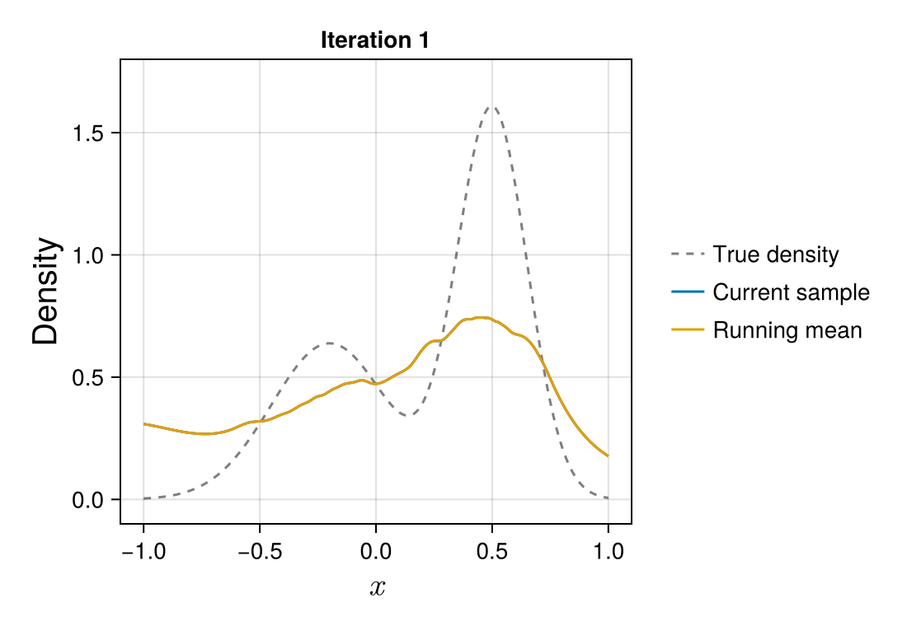

# A primer on Bayesian nonparametric density estimation

The following page provides a short introduction to nonparametric density estimation, with a particular focus on Bayesian approaches.
The topic of nonparametric density estimation is vast, and we do as such only aim to provide a rather broad overview here.
For an in-depth and quite accessible introduction to frequentist approaches in nonparametric density estimation, we recommend [Scott1992multivariate](@citet).
A good introduction to the Bayesian perspective, with a focus on practical computation, can be found in [Gelman2013bayesian](@citet).

## Introduction

The goal of density estimation is to infer an unknown density based on observed data. Given an independent and identically distributed sample ``x_1, x_2, \ldots, x_n`` from a density ``f``, the primary goal is to construct an estimate ``\hat{f}`` that is close to the true density. Parametric approaches to density estimation assume that the density belongs to a parametric family of distribution, such as the normal family of distributions, indexed by a parameter of low to moderate dimension. This approach is generally highly efficient if the true density belongs to or is well-approximated by a member of the postulated parametric family. However, in cases where the parametric family at hand is misspecified, the quality of the estimator ``\hat{f}`` is often of low quality.

In constrast, nonparametric approaches to density estimation strive to make less restrictive assumptions on the true density ``f``. This aim is acheived by employing richer classes of models which are able to approximate the true density under minimal smoothness assumptions. Unlike their parametric counterparts, most nonparametric density estimators are built on high- or even infinite-dimensional parameter spaces.

Although the increased flexibility of nonparametric approaches is an attractive feature, it can be quite challenging to construct well-working nonparametric density estimators owing to the high-dimensional parameter spaces. In particular, the high dimensionality of the parameter space introduces the need for some form of regularization, typically through the introduction of one or several smoothing parameters, so that the resulting estimates do not end up being too bumpy. As an illustration, consider the well-known (frequentist) kernel density estimator:
```math
\hat{f}(x) = \frac{1}{nh}\sum_{i=1}^n \phi\Big(\frac{x - x_i}{h}\Big),
```
where ``\phi(\cdot)`` is the probability density function of the standard normal distribution and the bandwidth ``h > 0`` is a parameter which controls the smoothness of the estimate.
To illustrate the role of the smoothing parameter, we generated a sample of size ``n = 1000`` from the following mixture density
```math
f(x) = \frac{0.4}{0.25} \phi\Big(\frac{x+0.2}{0.25}\Big) + \frac{0.6}{0.15}\phi\Big(\frac{x-0.5}{0.15}\Big).
```
We then fitted a kernel density estimator for three different choices of the bandwidth parameter. The resulting density estimates are shown in the figure below:


For the smallest choice of the bandwidth parameter, the estimate ``\hat{f}`` is very wiggly, severly distorting the shape of ``f`` with many small bumps. On the other hand, the largest bandwidth results in far too much smoothing, and the resulting density estimate fails to resemble ``f``. A good choice of the bandwidth parameter needs to strike a balance between these two extremes.

In practical applications, the true density is of course not known, and one has to select the smoothing parameter in a data-driven manner. Frequentist approaches to selecting the smoothing parameter are often based on optimizing some criterion that balances representational capacity against model complexity. Examples include the optimization of a cross-validation criterion or the minimization of an asymptotic expansion of a risk function.

## The Bayesian approach
Bayesian statistics offers a fundamentally different approach to nonparametric density estimation. Here, the density ``f`` is itself treated as a random quantity, and is assigned a prior distribution ``p(f)``. Density estimates in Bayesian models are based on the posterior distribution,
```math
p(f\,|\, x_1, \ldots, x_n) \propto p(f)\prod_{i=1}^n f(x_i).
```

Unlike frequentist approaches to smoothing parameter selection, where they are typically chosen via an optimization, the Bayesian approach implicitly introduces smoothing through the prior distribution. By utilizing a prior distribution that allows for ``f`` to be of varying degrees of smoothness, Bayesian procedures lead to data-driven choices to smoothing parameter(s) through the posterior distribution ``p(f\,|\, x_1, \ldots, x_n)``. Although the posterior gives a full distribution over the density ``f``, statisticians are often interested in providing a point estimate ``\hat{f}(x)``, along with some uncertainty measure. A popular point estimate in the Bayesian setting is the posterior mean, ``\hat{f}(x) = \mathbb{E}[f(x)\,|\, x_1, \ldots, x_n]``, while uncertainty quantification is usually provided in the form of a ``95 \%`` pointwise credible band, which is constructed by finding two functions ``l`` and ``u`` which satisfy ``P(l(x)\leq f(x) \leq u(x)\,|\, x_1, \ldots, x_n) = 0.95`` for all ``x``. A key challenge in the Bayesian approach to density estimation is that for most genuinely nonparametric models, the posterior distribution ``p(f\,|\, x_1, \ldots, x_n)`` is often not tractable analytically, and as such, posterior summaries cannot be computed exactly. Instead, inference is mostly based on Monte Carlo approximations, where one generates samples ``f^{(1)}, \ldots, f^{(M)}`` from the posterior distribution of ``f``, and uses them to approximate key posterior quantities. For instance, the posterior mean can be approximated by
```math
    \mathbb{E}[f(x)\,|\, x_1, \ldots, x_n] \approx \frac{1}{M}\sum_{m=1}^M f^{(m)}(x),
```
while approximate posterior credible bands can be constructed via the sample quantiles of ``f(x)``.

### Markov chain Monte Carlo
Although the Monte Carlo method is a powerful technique for approximating key quantities of interest, the process of generating samples from the posterior distribution is less straightforward. Moreover, the high- to infinite dimensional nature of nonparametric procedures further complicate this issue, as the techniques employed for approximate inference in lower-dimensional Bayesian models often do not scale well to higher dimensions. The class of simulation schemes used to generate samples from the posterior distribution in the `BayesDensity` package are so-called Markov chain Monte Carlo (MCMC) methods. Here, one constructs a Markov chain ``f^{(1)}, \ldots, f^{(M)}`` of approximate samples form the posterior distribution, meaning that the distribution of ``f^{(m+1)}`` is in general dependent on the previous state ``f^{(m)}``. Although the sequence of densities generated from such a sampler are dependent, it can be shown under rather mild conditions that Monte Carlo approximations based on these samples approach their corresponding true values as the number of samples diverges to infinity.

To illustrate the appliation of Markov chain Monte Carlo methods to Bayesian density estimation, we applied the implemented MCMC sampler to a [`HistSmoother`](@ref) model with default hyperparameters based on the simulated sample from the two-component Gaussian mixture treated previously. The animation shown below displays the posterior draw ``f^{(m)}`` for the first ``200`` iterations of the sampler, along with the runnning mean.



For the first few draws, the samples ``f^{(m)}`` do not resemble the true density much due to the dependence on the initial value ``f^{(0)}``.[^1] However, it only takes the draws a few iterations to reach a stady state around which the remaining posterior draws fluctuate quickly. While there is considerable variation in the posterior draws of ``f`` after reaching the stationary distribution, the running mean of the draws stabilizes after a while, resulting in a density estimate which is quite close to the true data-generating density.

[^1]:
    The behavior observed in the animation, that the first few values of a Markov chain are not properly representative draws from the posterior distribution, is rather common when using Markov chain Monte Carlo methods. A common remedy to this fact is to use a so-called burn-in period, where one discards the samples from the first iterations of the sampler, in order to minimize any bias in posterior estimates caused by the initial values.

To estimate the true density, we ran the sampler for an additional 1900 iterations, and discarded the samples from the first 100 iterations to reduce the initialization bias in the estimates. The resulting approximations to the posterior mean and the ``95 \%`` pointwise credible bands are shown in the figure below.


### Variational inference
Variational inference (VI) is a designation used to describe a class of methods that construct deterministic approximations to posterior distributions. The main benefit of the variational approach over Markov chain Monte Carlo methods is that the approximations to key posterior quantities are often of high quality, and that they are significantly faster to construct than generating a sufficient number of posterior draws via MCMC. Mathematically, variational approaches seek to find an approximation ``q(f)`` to the posterior ``p(f\,|\, x_1, \ldots, x_n)``, where the density ``q`` belongs to a family of distributions that is easy to sample from. Most variational approaches are based on minimizing the [Kullback--Leibler divergence](https://en.wikipedia.org/wiki/Kullback%E2%80%93Leibler_divergence) between ``q`` and the posterior, as this objective has certain mathematical properties that make it especially suitable for numerical optimization techniques. Having fitted a variational posterior, we can apply the Monte Carlo method to independent samples ``f^{(m)}\sim q(f)`` to compute e.g. the posterior mean.[^2]
Unlike estimates based on Markov chain Monte Carlo, where true posterior quantities can be recovered in the limit as the number of samples approaches infinity, variational approximations induce some irreducible error due to their approximate nature.

[^2]:
    Analytical expressions for posterior means and credible intervals for ``f`` are often not available under ``q``. In this case, we resort to a Monte Carlo approximation.

To illustrate the application of variational methods to density estimation, we return to the two-component normal mixture data considered previously. We have fitted a variational approximation to the same `HistSmoother` considered previously. The plot below shows the resulting approximate posterior mean and the ``95 \%`` pointwise credible bands.


For this particular example, the estimates obtained from the variational approximation are in very close agreement to those obtained via MCMC. Note that the quality of the variational approximation is in general highly model-dependent, and you should not necessarily expect to see such close agreement between posterior draws via MCMC and the approximate VI posterior for all the models implemented in `BayesDensity`.