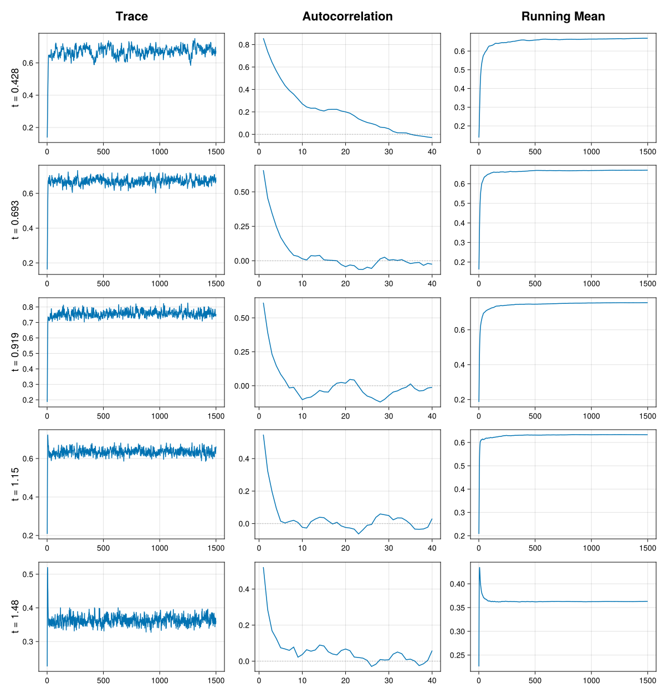

# MCMC diagnostics

Markov chain Monte Carlo (MCMC) is a powerful technique for generating approximate samples from posterior distributions.
However, because these samples are approximate and serially correlated, it is rarely obvious whether a chain has converged to its target distribution, or whether enough samples have been drawn to make accurate inferences.
A closely related notion is the chain's *mixing*: how efficiently it moves through the target distribution.
A well-mixing chain explores the posterior rapidly and produces samples with low correlation, whereas a poorly mixing chain moves sluggishly and carries far less information per sample.
Convergence diagnostics address these issues by quantifying how reliably a finite set of samples represents the underlying posterior.

This page offers a practical introduction to the tools provided by BayesDensity.jl to assess the output from MCMC methods.
For readers looking to expand their knowledge on the topic of convergence assessment, we refer to the review article of [Roy2020Convergence](@citet) for a more general introduction to various MCMC diagnostic tools.

The issue of diagnosing convergence is more complicated in Bayesian nonparametric models than in their parametric counterparts, as the key quantity of interest is a function, rather than a set of interpretable scalar parameters [Pham2018gammslice](@citep).
To faciliate model-agnostic convergence assessments, we follow the approaches taken in the densEstBayes [Wand2023densestbayes](@citep) and gamselBayes [He2025gamselBayes](@citep) R packages of monitoring the density ``f^{(m)}(t)`` at a grid of ``t`` as a function of the iteration number ``m``.
While this approach provides valuable information on the mixing properties of the generated chains, we caution users that for specific model types, there may be other quantities that should also be monitored to ensure that the Markov chains are mixing well. An example of such a key quantity is the number of mixture components in [`RandomFiniteGaussianMixture`](@ref) models, c.f. [Fruhwirth2021Telescope](@citet).

## Diagnosis tools for single chains
To showcase the use of the diagnostic tools offered as part of BayesDensity.jl, we focus on a particular example dataset consisting of 7201 British incomes recorded in the year 1975. These data have been standardized so that the sample mean is ``1``. To start, we fit a [`BSplineMixture`](@ref) model to the dataset using a total of `1500` samples, with the first `500` discarded as burn-in.

```julia
using BayesDensityBSplineMixture
using CairoMakie
using CodecXz
using Downloads
using Random
using RData

# Set seed for reproducibility
rng = Xoshiro(1984)

# Read rdata file
url  = "https://raw.githubusercontent.com/cran/densEstBayes/master/data/incomeUK.rda"
path = Downloads.download(url)
data = load(path)["incomeUK"]

# Create a model object
bsm = BSplineMixture(data)

# Sample from the posterior
ps1 = sample(rng, bsm, 1500; n_burnin=500)
```

#### Visual convergence diagnostics

BayesDensity.jl provides the [`BayesDensityCore.Makie.check_chains`](@ref) and [`BayesDensityCore.Plots.check_chains`](@ref) methods to visually diagnose Markov chains. None of these methods are directly exported by `BayesDensityCore` in order to avoid a namespace conflict, but they are both accessible provided that `BayesDensityCore` and either `Makie` or `Plots` are loaded/imported. In the following, we showcase the Makie implementation, but note that the syntax for using the `Plots` version is similar.

In the code snippet below, `check_chains` evaluates the density at the sample hexiles and then produces traceplots, autocorrelation plots, and a running-mean plot for the density evaluated at each hexile separately.

```julia
fig1 = BayesDensityCore.Makie.check_chains(ps1; grid=quantile(data, (1:5)/6), include_burnin=true)
save(joinpath("src", "assets", "diagnostics_example", "diagnostics_example.svg"), fig1)
fig1
```



The trace plots in the leftmost column show the values of ``f^{(m)}(t)``, for each ``t`` in the specified grid, as a function of the iteration number ``m``. A trace plot is typically characterized by two periods with distinct behavior. During the first few iterations — the warm-up (or burn-in) phase — the chain moves from its starting point toward the region of high posterior probability, so the density evaluations often show a clear trend as they settle. After this initial phase, the plots should ideally show the density evaluations changing rapidly around a stable level, with no lingering trend and no long stretches stuck at a single value. This "fuzzy caterpillar" appearance is a sign that the chain has reached its stationary distribution and is exploring it efficiently. Based on the above trace plots, we see that all chains appear to have reached the stationary distribution within ``200`` iterations; this indicates that the chosen burn-in period of `500` is more than sufficient for this example.

The autocorrelation plots in the middle column show the sample autocorrelation of ``f^{(m)}(t)``, for each ``t`` in the specified grid, as a function of the lag ``k``. The autocorrelation at lag ``k`` measures the correlation between density evaluations ``k`` iterations apart, ``f^{(m)}(t)`` and ``f^{(m+k)}(t)``; by construction it equals one at lag zero and, for a well-behaved chain, decays toward zero as the lag grows. Because MCMC produces dependent draws, some autocorrelation at short lags is expected, so what matters is how quickly it decays. A rapid drop to near zero within a few lags indicates that the chain mixes well and that nearby iterations carry largely independent information. Autocorrelation that stays high and decays only slowly is a warning sign: it means the chain explores the distribution sluggishly, so that even a long run yields relatively few effective samples — a low effective sample size. Note that `check_chains` computed the autocorrelation using the non-burnin samples only, even if `include_burnin` is set to `true`. In the above plot, all autocorrelation drop to zero fairly quickly, indicating satisfactory mixing.

The running-mean plots in the rightmost column show the cumulative average of ``f^{(m)}(t)``, that is ``\frac{1}{m}\sum_{j=1}^{m} f^{(j)}(t)``, for each ``t`` in the specified grid, as a function of the iteration number ``m``. As samples accumulate, this running estimate of the posterior mean should settle down and flatten out around a stable value. A curve that has clearly levelled off suggests the estimate has stabilized, whereas one that is still drifting indicates that the chain has not yet converged or that more samples are needed. The above plot clearly shows that all running means have stabilized.

#### Scalar convergence diagnostics
Although the above diagnostic plots are very useful for discovering convergence problems, they do not provide sufficient information alone to determine if the number of generated Monte Carlo samples is sufficient for reliable posterior inference. To faciliate checks of whether one has generated enough samples, BayesDensityCore provides a [`MCMCDiagnosticTools`](@extref MCMCDiagnosticTools) package extension that allows the user to easily compute metrics such as the effective sample size and the ``\hat{R}`` diagnostic for ``f^{(m)}(t)``.

The *effective sample size* (ESS) estimates how many independent draws the autocorrelated samples are worth at each grid point: because successive iterations are correlated, ``M`` samples generally carry less information than ``M`` independent ones, so an ESS that is small relative to the total number of iterations signals poor mixing and imprecise estimates of ``f(t)``. The ``\hat{R}`` diagnostic instead targets convergence by comparing the variability of ``f^{(m)}(t)`` within each chain: when the chain has converged to the same distribution these agree and ``\hat{R}`` is close to one, while values appreciably above one indicate that the chains disagree and have not yet converged.

To illustrate the utility of the aforementioned extension, we compute the ESS and ``\hat{R}`` statistic using the [`MCMCDiagnosticTools.ess`](@ref) and [`MCMCDiagnosticTools.rhat`](@ref) methods.

```julia
using MCMCDiagnosticTools # Needed to load the package extension

ess_single = ess(ps1; grid = quantile(data, (1:5)/6))
rhat_single = rhat(ps1; grid = quantile(data, (1:5)/6))
println("Effective sample size for single chain: ", round.(ess_single; sigdigits=4))
println("R-hat for single chain: ", round.(rhat_single; sigdigits=4))
```

Running the above code snippet yields an `\hat{R}` of ``1.024`` and an ESS of ``54.21`` for the density evaluations at the first hexile. [Vehtari2021Rank](@citet) suggest using the threshholds ``\hat{R} < 1.01`` and `ESS > 400` indicate that the number of posterior samples is satisfactory. None of these thressholds are satisfied here, indicating that a greater number of samples is needed to make reliable posterior inferences.

## Diagnosis tools for multiple chains
For reliable posterior inference, running multiple Markov chains with different starting values of the parameters is strongly recommended. In cases where the posterior distribution is multimodal, a single chain may appear to mix well based on various convergence diagnostics, despite not having explored a high-probability region of the posterior distribution. In such cases, running multiple chains may be helpful in capturing convergence issues that would not have been revealed if a single chain was run instead.

Both the graphical and the scalar MCMC diagnostics are designed to work with the results from multiple Markov chains. We return to the income dataset to illustrate their application to multiple chains in practice.

First, we run four chains with different starting values for the parameters. Note that we have increased the length of each chain to `4500`, since a chain length of `1500` appeared to be much too short based on our previous diagnostic assessment.

```julia
using Distributions # For initialization of the chains
ps_chains = Vector{Any}(undef, 4)
for i in eachindex(ps_chains)
    init_params = (β = rand(rng, Normal(0, 1), length(bsm)-1), τ2 = rand(rng, InverseGamma(1, 2e-4)))
    ps_chains[i] = sample(rng, bsm, 4500; n_burnin=500, initial_params=init_params)
end

fig2 = BayesDensityCore.Makie.check_chains(ps_chains...; grid=quantile(data, (1:5)/6), include_burnin=true)
save(joinpath("src", "assets", "diagnostics_example", "diagnostics_example2.svg"), fig2)
```


The above trace plots indicate that all chains converge quickly to the stationary distribution. The autocorrelation functions also decay quite quickly to ``0`` indicating good mixing.

Next, we compute the ESS and ``\hat{R}`` diagnostics:
```julia
ess_chains = MCMCDiagnosticTools.ess(ps_chains...; grid = quantile(data, (1:5)/6))
rhat_chains = MCMCDiagnosticTools.rhat(ps_chains...; grid = quantile(data, (1:5)/6))
println("Effective sample size for four chains: ", round.(ess_chains; sigdigits=4))
println("R-hat for four chains: ", round.(rhat_chains; sigdigits=4))
```

In this case, the ``\hat{R}`` and ESS all meet the threshholds recommended by [Vehtari2021Rank](@citet), indicating that the obtained samples can be used to reliably infer the posterior mean.