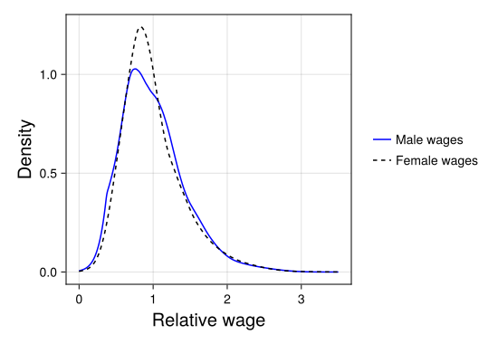

# Model selection
In this example notebook, we will show how `BayesDensity` can be used to investigate whether two random samples follow the same distribution.

Suppose that we observe two independent samples ``x_1, \ldots, x_n \sim f`` and ``y_1, \ldots, y_m \sim g``. In many applications it is of interest to test whether both samples come from a common distribution ``f`` against the alternative that ``f \neq g``. Although this is a problem that can be tackled by frequentist methods, the Bayesian solution based on model selection, that we focus on here, provides a rather elegant alternative. Here, we proceed by constructing two competing models, one under which the data-generating density is constrained to be the same across both groups, and another where the densities are allowed to differ.

To assess which model fits the data better, a popular approach is to use an estimate of out-of sample predictive performance, and to choose the model that performs better with respect to this criterion. A popular metric for Bayesian model comparison is the [widely applicable information criterion]((https://en.wikipedia.org/wiki/Watanabe-Akaike_information_criterion)), [Watanabe2010WAIC](@citep), as it is large-sample equivalent to leave-one-out cross-validation, and it is easily computed from posterior samples. For the model where the two densities are not equal, the WAIC can be computed via

```math
\begin{align*}
\text{WAIC} =& -2\sum_{i=1}^n \log \Big\{\frac{1}{S}\sum_{s=1}^S f^{(s)}(x_i)\Big\} -2\sum_{j=1}^m \log \Big\{\frac{1}{S}\sum_{s=1}^S g^{(s)}(y_j)\Big\} \\ +& 2\sum_{i=1}^n \widehat{\mathbb{V}}\big[\log f(x_i)\big] + 2\sum_{j=1}^m \widehat{\mathbb{V}}\big[\log g(y_j)\big],
\end{align*}
```
where ``f^{(s)}, g^{(s)}`` are samples from the posterior distributions ``p(f\,|\, \boldsymbol{x})`` and ``p(g\,|\, \boldsymbol{y})`` under the independent model assumption, and ``\widehat{\mathbb{V}}\big[\log h(y_i)\big]`` is the sample variance of ``\log h^{(s)}(y_i)`` for ``h \in \{f, g\}``. In particular, a smaller value of this criterion is indicative of better model fit. On the other hand, the WAIC under the pooled data model where ``f = g`` the WAIC is given by

```math
\begin{align*}
\text{WAIC} =& -2\sum_{i=1}^n \log \Big\{\frac{1}{S}\sum_{s=1}^S f^{(s)}(x_i)\Big\} -2\sum_{j=1}^m \log \Big\{\frac{1}{S}\sum_{s=1}^S f^{(s)}(y_j)\Big\} \\ +& 2\sum_{i=1}^n \widehat{\mathbb{V}}\big[\log f(x_i)\big] + 2\sum_{j=1}^m \widehat{\mathbb{V}}\big[\log f(y_j)\big],
\end{align*}
```
where ``f^{(s)}`` now denotes samples from the pooled-data posterior ``p(f\,|\, \boldsymbol{x}, \boldsymbol{y})``.

## A real-data example

To illustrate how to use `BayesDensity` for model comparison in practice, we consider a dataset consisting of ``11130`` average hourly earnings from the Current Population Survey, collected in the year ``1998``. This dataset also provides the sex of each respondent, allowing us to study differences in the male and female wage distributions. After a cursory look at this dataset, one quickly discovers that the male average wage is considerably higher than the female average. Another interesting question to explore is whether the distribution of female wages relative to the female mean wage differs from the distribution of male wages relative to their respective mean. In order to keep our analysis noninformative, we assign equal prior probabilities to the null hypothesis and the alternative.

To begin answering this question, we first need to load the dataset in question:

```julia
using DataFrames
using RDatasets

# Load dataset and extract average hourly earnings by sex:
wage_data = dataset("Ecdat", "CPSch3")
male_wages = wage_data[wage_data.Sex .== "male", :].AHE
female_wages = wage_data[wage_data.Sex .== "female", :].AHE

# Find the male and female wages relative to their respective group averages:
male_rel_wages = male_wages / mean(male_wages)
female_rel_wages = female_wages / mean(female_wages)
```

Next, we fit a [`BSplineMixture`](@ref) to the joint sample, and the male and female samples separately via variational inference:

```julia
using BayesDensityBSplineMixture
model_male = BSplineMixture(male_rel_wages; prior_global_rate=1e-4, bounds=(0.0, 3.5))
model_female = BSplineMixture(female_rel_wages; prior_global_rate=1e-4, bounds=(0.0, 3.5))
model_joint  = BSplineMixture(vcat(male_rel_wages, female_rel_wages); prior_global_rate=1e-4, bounds=(0.0, 3.5))

# Fit variational approximations:
male_viposterior, male_info = varinf(model_male)
female_viposterior, female_info = varinf(model_female)
joint_viposterior, joint_info = varinf(model_joint)
```

To have a cursory look at whether or not the hypothesis that the two samples have the same distribution, we decided to plot the estimated posterior medians of the densities of the male and female relative wage distributions separately:

```julia
using CairoMakie
fig = Figure(size=(550, 380))
ax = Axis(fig[1,1], xlabel="Relative wage", ylabel="Density", xlabelsize=20, ylabelsize=20)
plot!(ax, male_viposterior, label="Male wages", ci=false, strokecolor=:blue, estimate=median)
plot!(ax, female_viposterior, label="Female wages", ci=false, strokecolor=:black, linestyle=:dash, estimate=median)
Legend(fig[1,2], ax, framevisible=false)
save(joinpath("src", "assets", "model_selection", "relative_wages_by_sex.svg"), fig)
```



Based on the above display, it appears that the distribution of male wages is a bit more dispersed than the female distribution, which could indicate that the null hypothesis is false in this case, especially given the fact that the sample sizes involved are quite large.

To carry out the formal Bayesian analysis of this question, we need to compute the ``\text{WAIC}`` under both model specifications. We start by writing a funtion for computing the WAIC of each model:
```julia
function compute_waic(ps::PosteriorSamples)
    # Note that the original data to which a `BSplineMixture`
    # object was fit is stored under `bsm.data.x`.
    logpdfs = log.(pdf(ps, model(ps).data.x))
    lppd = sum(log.(mapslices(mean, exp.(logpdfs); dims=2)))
    effpar = sum(vec(mapslices(var, logpdfs; dims=2)))
    return -2 * (lppd - effpar)
end
```

Next, we compute the WAIC of the three models using the above function. Note that under the unconstrained model specification, the WAIC decomposes nicely into the sum of the WAICs of both models evaluated on their respective samples since both the priors and the likelihoods are independent in this case.

```julia
using Random
rng = Xoshiro(1984)

waic_male = compute_waic(sample(rng, male_viposterior, 10_000))
waic_female = compute_waic(sample(rng, female_viposterior, 10_000))
waic_joint = compute_waic(sample(rng, joint_viposterior, 10_000))
waic_separate = waic_male + waic_female

waic_joint, waic_separate
```


After running the above code snippet, we obtain a WAIC of ``11036`` for the constrained model and a ``10968`` for the unconstrained one, strongly favoring the latter model. The results obtained here indicate that the two samples indeed follow different distributions.